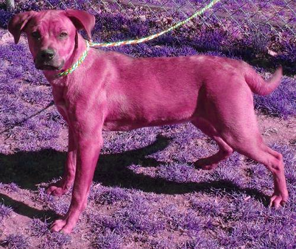

Doing it in Java to ensure easy portability to android later.

1. Implement SVM for color features first. 

Step 1 : 

+ Load image into Java and get RGB values.
	+ [Image2RGB](http://www.tutorialspoint.com/java_dip/understand_image_pixels.htm)
+ Convert RGB to HSV.
	+ [RGB2HSV](http://stackoverflow.com/a/2399174)
+ Check if conversion is proper by convertion hsv to rgb back to image file.
	+ [How to write RGB image as file](http://www.lac.inpe.br/JIPCookbook/1300-create-rgb.jsp)
	+ [How to convert int RGB to array : use color constructor](http://docs.oracle.com/javase/7/docs/api/java/awt/Color.html)
	+ [HSV2RGB](http://docs.oracle.com/javase/7/docs/api/java/awt/Color.html#HSBtoRGB(float,%20float,%20float))

	Result : succesful, but color seems to change for seem reason. WHY?

	
	

	Fixed : RGB order was off. No more problem now. 

Step 2 : 

+ Cell size = 250/N.
+ Split each h,s,v into c_h, c_s and c_v bands of equal width.
+ temp data type of cell size * cell size * c_h * c_s * c-s as a boolean 5D array indicating whether each cell has h,s,v belonging to  
[1...N][1...N][1...C_h][1...C_s][1.....C_v]
+ extract cells from matrix : [code](trash/testExtractCells.java)
+ get feature array
+ flatten into vector
	+ [stack oveflow](http://stackoverflow.com/questions/2569279/how-to-flatten-2d-array-to-1d-array)
	+ [how to use .jar files](http://stackoverflow.com/questions/460364/how-to-use-classes-from-jar-files)

	